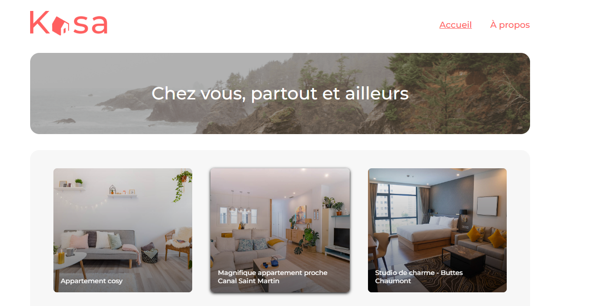

# Projet Kaza - Location Immobilière

Ce projet consiste à développer une application web de location immobilière avec React.

## Comment Exécuter le Projet Localement

1. Clonez ce dépôt : `git clone https://github.com/JaouharOUERTANI/kaza.git`
2. Accédez au répertoire du projet : `cd kaza`
3. Installez les dépendances : `npm install` ou `yarn install`
4. Démarrez l'application : `npm start` ou `yarn start`
5. L'application devrait être accessible localement à l'adresse [http://localhost:3000](http://localhost:3000).

## Lien vers la Version Déployée

Vous pouvez consulter la version déployée du projet https://kaza-rho.vercel.app/.

## Compétences évaluées

- Développer une interface web avec Sass
- Mettre en œuvre des animations CSS
- Initialiser une application avec Create React App
- Configurer la navigation entre les pages de l'application avec React Router
- Développer des éléments de l'interface d'un site web grâce à des composants React

